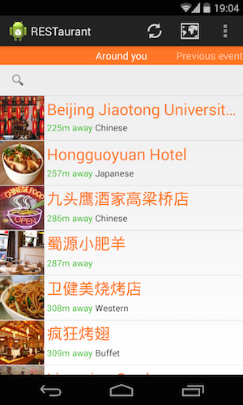
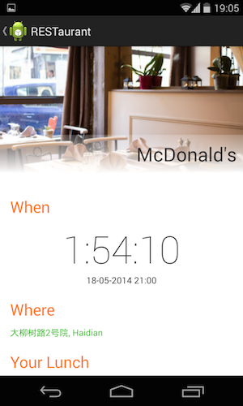
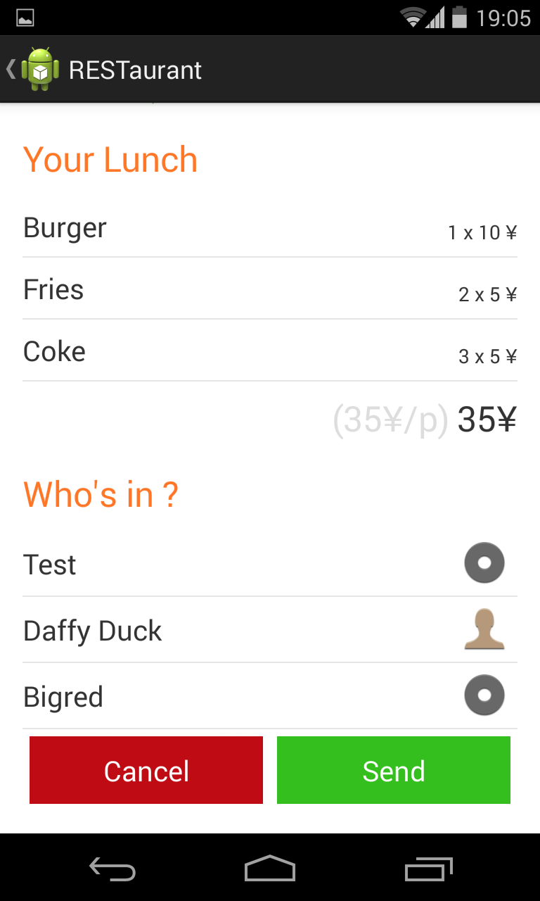
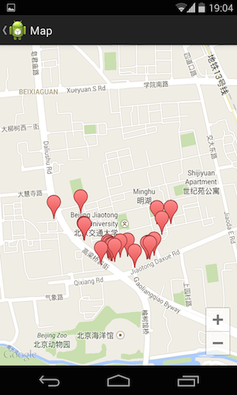

Android App for the RESTaurant project.

Introduction
----------

This project is the Android client for the [RESTaurant API](https://github.com/gaodayue/RESTaurant_backend). The software stack we choose is:

* square.Retrofit for restful communication
* square.otto     for an event driven data management
* square.picasso  for picture retriving
* Gson            for json serialisation
* Google services for google maps service
* Baidu push service

Developpement environnement
----------

This project have been developped under Android studio 0.5.2

Usage
----------

* Display the list of nearby restaurants using Google places
* Search restaurant by name or food category
* Display the restaurants on a map
* Make your meal from a dishes list
* Invite friends and check who is coming or not
* Send the order to the restaurant to book
* receive the validation
* get a countdown to the event time and get the way to go there using google navigation

